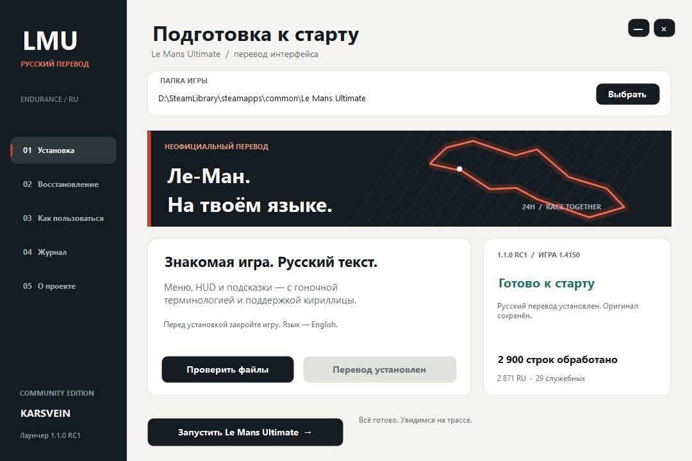

# Le Mans Ultimate — русский перевод

**Версия 1.1.0 RC1: HUD ожидает визуальной проверки в заезде.**

**Ле-Ман. На твоём языке.** Неофициальный перевод интерфейса и компактный Windows-лаунчер от Karsvein.

[**Скачать готовый лаунчер →**](https://github.com/kasyanovea17-crypto/le-mans-ultimate-ru/releases)



## Что внутри

- **2 386** обработанных строк двух словарей: **2 357** с русским текстом и **29** технических обозначений, единиц, брендов и служебных шаблонов.
- Ещё **514** строк нативного HUD: круги, интервалы, пит-стопы, флаги, штрафы, стратегия и сообщения инженера. Всего **2 900** обработанных строк, из них **2 871** с русским текстом.
- Меню, настройки, подсказки и сетевые разделы, представленные в словарях.
- Кириллица в **641** растровом шрифте. Все **62 314** исходных символов, их метрики и пиксели сохранены; новые символы построены из открытых Roboto / Roboto Condensed.
- Пять статических шрифтов Roboto / Roboto Condensed с кириллицей.
- Поиск игры в библиотеках Steam, проверка файлов, установка, восстановление оригинала, импорт ранее сохранённой копии и запуск через Steam.
- Всё необходимое встроено в EXE. Python, Node.js и скачивание полного архива игры не нужны.

## Установка

1. Скачайте ZIP из **Releases**, распакуйте в отдельную папку и откройте `LMU-RU-Launcher.exe`.
2. Закройте игру. Проверьте автоматически найденную папку или нажмите **«Выбрать»**.
3. Нажмите **«Проверить файлы»**, затем **«Установить перевод»**. Для записи в Program Files установщик может запросить права администратора.
4. **Оставьте язык игры English**: перевод занимает английский языковой слот.
5. Нажмите **«Запустить Le Mans Ultimate»**.

Поддерживается проверенный архив **Le Mans Ultimate 1.4150**, а не любая версия с похожим номером. Требуются Windows x64, .NET Framework 4.8 и примерно 4 ГБ свободного места на диске с игрой для резервной копии и сборки архива. Лаунчер не подписан цифровым сертификатом.

## Восстановление

Во вкладке **«Восстановление»** нажмите **«Восстановить оригинал»**. Исходные ресурсы хранятся рядом с игрой:

```text
Le Mans Ultimate/Bin/LMU-RU-backup/UI.original.zip
Le Mans Ultimate/Bin/LMU-RU-backup/native/
```

Копия проверяется по SHA-256 и остаётся после восстановления. Сохранения и настройки управления не меняются. Не удаляйте эту папку, пока она нужна для отката.

Если ранее использовалась пробная версия перевода, нажмите **«Указать исходный UI.zip»** и выберите сохранённый оригинал. Чужая версия или повреждённая копия не принимается.

После обновления Steam повторите проверку: неизвестный `UI.zip` не перезаписывается. Дождитесь совместимого выпуска перевода. Лаунчер сам не загружает и не исполняет обновления; кнопка свежих версий открывает страницу Releases.

## Как устроено

Установщик хранит русские словари, открытые шрифты, дополнительные растры кириллицы и небольшие правила изменения CSS/JavaScript. Исходные растры игровых шрифтов в пакет не включены. Формат растров соответствует [DirectXTK SpriteFont](https://github.com/microsoft/DirectXTK/blob/main/MakeSpriteFont/SpriteFontWriter.cs). **Оригинальный `UI.zip`, игровые исполняемые файлы и полный JavaScript игры не входят в репозиторий или выпуск.** Архив собирается локально из проверенной копии установленной игры.

- Исходный SHA-256: `7456925e14e4433045cfb67f866d5716c25ea02d9f34c1ea06156ede5b21aa96`.
- Перед заменой: проверка резервной копии, трёх точек отображения строк и всех включённых ресурсов.
- При проверке собранного архива каждый посторонний ресурс сравнивается с оригиналом по SHA-256.
- Каждый файл заменяется атомарно. Меню и HUD — последовательные этапы, не единая атомарная операция. При ошибке HUD уже заменённые нативные файлы возвращаются в предыдущее состояние; перевод меню может остаться установленным. После прерывания питания смешанное распознанное состояние HUD можно завершить повторной установкой или восстановить. На время операции действует блокировка. При запущенной игре установка и восстановление останавливаются.
- Обновление словаря не меняет числовые/API-значения настроек. Исполняемые файлы игры не изменяются.

Текст в рекламных изображениях, серверные новости и ресурсы за пределами включённых словарей не относятся к этому пакету. В оригинале `LMP3_DESCRIPTION` содержит служебный идентификатор, а не описание; он сохранён. Совместимость сетевых гонок и всех устройств не заявляется на основании проверки меню.

## Сборка из исходников

В Windows PowerShell из каталога репозитория:

```powershell
.\build.ps1 -Test
```

Используется штатный C#-компилятор .NET Framework. Результат — `build/LMU-RU-Launcher.exe`. Пакет ресурсов встраивается при сборке; отдельные каталоги payload конечному пользователю не нужны.

Проверка на своей отдельной копии оригинального архива:

```powershell
.\build\EngineTests.exe --real "D:\Original\UI.zip" "D:\LMU-RU-test-game" "D:\Original\Native"
```

Папка `D:\Original\Native` должна содержать исходные `Support/Languages/english.dic` и `Core/Shared/SpriteFonts/*.spritefont` с исходной структурой каталогов. Тестовая папка должна быть новой. Тест создаёт фиктивный маркер EXE (никогда его не запускает), устанавливает перевод, проверяет все ресурсы, восстанавливает исходные байты и повторно устанавливает перевод. Настоящая игра этим тестом не меняется.

## Проверки

См. [результаты проверки](docs/TEST_RESULTS.md): модульные тесты установщика, состояния интерфейса и полный цикл на архиве 1.4150. Предыдущий перевод и его оригинальная копия сохранены отдельно при разработке.

## Шрифты и авторство

Roboto и Roboto Condensed распространяются по SIL Open Font License; тексты лицензий и ссылки на источники лежат в `payload/files/`. Отдельная лицензия на остальной проект пока не назначена.

Это проект сообщества. Он не связан со Studio 397, Motorsport Games, ACO или правообладателями игры. Названия используются для указания совместимости.
